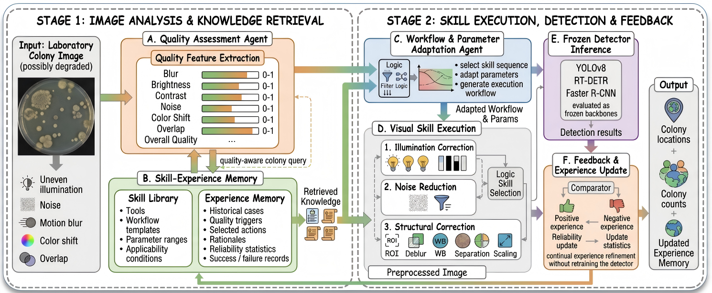

# ColonyAgent

**Knowledge-Guided Skills Agent for Microbial Colony Detection in Automated Laboratoryn**

A scientific AI system that applies XSkill's Skill+Experience framework to image preprocessing and detection tool orchestration for microbial colony counting on agar plates.

---

## Table of Contents

- [Overview](#overview)
- [Key Features](#key-features)
- [Architecture](#architecture)
- [Installation](#installation)
- [Quick Start](#quick-start)
- [Detailed Usage](#detailed-usage)
- [Project Structure](#project-structure)
- [Configuration](#configuration)
- [Data Format](#data-format)
- [Output Format](#output-format)
- [Evaluation](#evaluation)
- [Citation](#citation)

---

## Overview

ColonyAgent addresses the challenge of detecting microbial colonies on agar plates in varying imaging conditions. It uses an LLM-driven Agent that dynamically selects preprocessing tools based on image quality assessment, improving detection performance through continual learning from experience.

### Background

Image degradation (blur, noise, uneven illumination, low contrast) significantly impacts detection accuracy. Traditional approaches use fixed preprocessing pipelines, but ColonyAgent adapts to each image's specific quality issues.

### How It Works

1. **Quality Assessment**: 6D quality vector (blur, brightness, contrast, noise, color bias, overall)
2. **Experience Retrieval**: Find similar past experiences based on quality vector
3. **Skill Adaptation**: Adapt reusable workflow templates to current image
4. **LLM Orchestration**: Decide tool sequence via function calling
5. **Detection & Feedback**: Detect and evaluate, update experience bank

---

## Key Features

- **Adaptive Preprocessing**: Agent dynamically selects preprocessing tools based on image quality
- **Continual Learning**: Experiences are accumulated and merged over time, improving with each run
- **Multi-Detector Support**: YOLOv8, RT-DETR, Faster R-CNN
- **Skill Library**: Reusable tool workflow templates extracted from successful trajectories
- **Experience Bank**: Tactical rules (condition→action) for different quality patterns
- **Dual-mode Agent**: LLM function-calling with rule-based fallback

---

## Architecture

### Core Components

| Component | File | Description |
|-----------|------|-------------|
| `ColonyDetectionAgent` | `agent/colony_agent.py` | LLM function-calling for tool orchestration |
| `ExperienceManager` | `knowledge/experience_manager.py` | Stores/retrieves/merges tactical rules |
| `ExperienceRetriever` | `knowledge/experience_retriever.py` | Finds relevant experiences by quality vector |
| `SkillBuilder` | `knowledge/skill_builder.py` | Extracts workflow templates from trajectories |
| `SkillAdapter` | `knowledge/skill_adapter.py` | Adapts skills to current image quality |
| `ImageQualityAssessor` | `quality/assessor.py` | 6D image quality assessment |
| `FeedbackLoop` | `agent/feedback.py` | Generates experience updates from metrics |
| `TrajectorySummarizer` | `knowledge/trajectory_summary.py` | Summarizes agent trajectories |
| `ExperienceCritic` | `knowledge/experience_critique.py` | Cross-rollout critique for experience updates |

### System Architecture



### Tool System

All tools implement `BaseTool.call(image, **params) -> ToolResult`:

**Preprocessing Tools** (`tools/preprocessing/`):
| Tool | Effect |
|------|--------|
| CLAHE | Contrast enhancement via adaptive histogram equalization |
| Denoise | Noise reduction (median/NLM filtering) |
| Sharpen | Edge enhancement via unsharp mask |
| White Balance | Color correction (gray world algorithm) |
| Illumination | Illumination correction (Retinex-based) |
| ROI Extract | Region of interest extraction via Hough circles |
| Colony Separation | Watershed-based colony separation |

**Detection Tools** (`tools/detection/`):
| Tool | Description |
|------|-------------|
| YOLOv8 | Ultralytics YOLOv8 detector |
| RT-DETR | Real-Time DEtection TRansformer |
| Faster R-CNN | torchvision Faster R-CNN |

---

## Methods (M0-M4)

| Method | Preprocessing | Continual Learning | Use Case |
|--------|---------------|-------------------|----------|
| **M0-clean** | None (clean images) | No | Upper-bound baseline |
| **M1-no-preprocess** | None (degraded images) | No | Lower-bound baseline |
| **M2-fixed-pipeline** | Fixed CLAHE+Denoise+Sharpen | No | Traditional approach |
| **M3-adaptive** | Retrieval-guided adaptive workflow | No online refinement | Agent with fixed memory
| **M4-adaptive+CL** | Agent-guided | Yes | Full system |

---

## Installation

### Prerequisites

- Python 3.10+
- CUDA 11.8+ (for GPU support)
- MINIMAX API Key (for LLM function calling)

### Step 1: Clone Repository

```bash
git clone https://github.com/AdaptiveAgentWorks/ColonyAgent.git
cd ColonyAgent
```

### Step 2: Create Environment

```bash
# Using conda
conda create -n colonyagent python=3.10
conda activate colonyagent

# Or use existing environment with required packages
conda activate colonyagent  # your environment
```

### Step 3: Install Dependencies

```bash
pip install -r requirements.txt
```

### Step 4: Configure API Key

```bash
# Create .env file
cat > .env << EOF
MINIMAX_API_KEY=your_api_key_here
EOF
```

### Step 5: Verify Installation

```bash
python -c "from loguru import logger; print('OK')"
python -c "import yaml; print('OK')"
python -c "import ultralytics; print('OK')"
```

---

## Quick Start

### 1. Prepare Data

Place your images and annotations in:
```
data/
├── train/
│   ├── images/
│   │   └── *.jpg
│   └── labels/
│       └── *.txt  (YOLO format)
└── test/
    ├── images/
    └── labels/
```

### 2. Build Knowledge Base (Phase 1)

```bash
source ~/miniconda3/etc/profile.d/conda.sh
conda activate microagent

python scripts/run_phase1.py \
    --config configs/default.yaml \
    --image_dir data/train/images \
    --annotation_file data/train/annotations.json \
    --output_dir memory/
```

### 3. Run Inference (Phase 2)

```bash
python scripts/run_phase2.py \
    --config configs/default.yaml \
    --image_dir data/test/images \
    --memory_dir memory/ \
    --output_dir results/
```

### 4. Evaluate Results

```bash
python scripts/evaluate.py \
    --results_dir results/ \
    --annotation_file data/test/annotations.json \
    --output evaluation_report.json
```

---

## Detailed Usage

### Phase 1: Offline Accumulation

Build knowledge base from training data.

```bash
python scripts/run_phase1.py \
    --config configs/default.yaml \
    --image_dir data/xcm_train_100_degraded/images \
    --annotation_file data/xcm_train_100_degraded/metadata.json \
    --output_dir memory/ \
    --num_rollouts 3 \
    --batch_size 10
```

**Parameters:**
| Parameter | Description | Default |
|-----------|-------------|---------|
| `--config` | Config YAML path | `configs/default.yaml` |
| `--image_dir` | Training images directory | Required |
| `--annotation_file` | COCO format annotations | Optional |
| `--output_dir` | Memory output directory | `memory/` |
| `--num_rollouts` | Rollouts per image | Config (3) |
| `--batch_size` | Images per batch | Config (10) |

**Output:**
```
memory/
├── experience_bank/      # JSON files with tactical rules
│   └── exp_*.json
├── skill_library/       # Markdown workflow templates
│   └── skill_*.md
└── trajectories/        # JSONL trajectory logs
    └── *_rollout*.jsonl
```

### Phase 2: Online Inference

Process new images with optional continual learning.

```bash
# Without continual learning (M3)
python scripts/run_phase2.py \
    --config configs/default.yaml \
    --image_dir data/test/images \
    --memory_dir memory/ \
    --output_dir results/

# With continual learning (M4)
python scripts/run_phase2.py \
    --config configs/default.yaml \
    --image_dir data/test/images \
    --memory_dir memory/ \
    --output_dir results/ \
    --enable_continual_learning
```

**Parameters:**
| Parameter | Description | Default |
|-----------|-------------|---------|
| `--config` | Config YAML path | `configs/default.yaml` |
| `--image_dir` | Test images directory | Required |
| `--memory_dir` | Pre-built memory directory | None |
| `--output_dir` | Results output directory | `results/` |
| `--enable_continual_learning` | Enable CL updates | Disabled |
| `--no_continual_learning` | Disable CL updates | Disabled |
| `--detector` | Force specific detector | Config |
| `--max_images` | Limit images to process | All |

### Run All Baselines (M0-M4)

```bash
# All methods + all detectors
python scripts/run_baselines.py \
    --config configs/experiment.yaml \
    --methods M0_clean M1_no_preprocess M2_fixed_pipeline M3_adaptive M4_adaptive_continual \
    --detectors yolov8 rtdetr fasterrcnn

# Specific method + detector
python scripts/run_baselines.py \
    --config configs/experiment.yaml \
    --methods M4_adaptive_continual \
    --detectors yolov8
```

### Evaluation

```bash
# Single method evaluation
python scripts/evaluate.py \
    --results_dir results/M4_adaptive_continual_yolov8/ \
    --annotation_file data/test/annotations.json \
    --output results/evaluation_report.json

# Multi-method comparison
python scripts/evaluate.py \
    --compare M0_clean=results/M0_clean_yolov8 \
              M1_no_preprocess=results/M1_no_preprocess_yolov8 \
              M3_adaptive=results/M3_adaptive_yolov8 \
              M4_adaptive_CL=results/M4_adaptive_continual_yolov8 \
    --annotation_file data/test/annotations.json \
    --output results/comparison_report.json

# Learning curve analysis
python scripts/evaluate.py \
    --learning_curve results/phase2_inference/ \
    --output results/learning_curve.json
```

---

## Project Structure

```
ColonyAgent/
├── scripts/                      # Entry points
│   ├── run_phase1.py           # Phase 1: Offline accumulation
│   ├── run_phase2.py            # Phase 2: Online inference
│   ├── run_baselines.py         # Run M0-M4 experiments
│   └── evaluate.py              # Evaluation script
│
├── pipeline/                    # Core pipelines
│   ├── phase1_accumulate.py     # Phase 1 implementation
│   ├── phase2_inference.py      # Phase 2 implementation
│   └── evaluator.py             # Evaluation logic
│
├── agent/                       # Agent components
│   ├── colony_agent.py          # Core LLM-driven agent
│   └── feedback.py              # Feedback loop
│
├── knowledge/                   # Knowledge management
│   ├── experience_manager.py    # Experience storage/merge
│   ├── experience_retriever.py  # Experience retrieval
│   ├── skill_builder.py         # Skill extraction
│   ├── skill_adapter.py         # Skill adaptation
│   ├── trajectory_summary.py    # Trajectory summarization
│   └── experience_critique.py  # Cross-rollout critique
│
├── quality/                     # Quality assessment
│   ├── assessor.py              # 6D quality assessment
│   └── vision_assessor.py       # VLM-based quality check
│
├── tools/                       # Tool system
│   ├── base.py                  # BaseTool class
│   ├── registry.py              # Tool registration
│   ├── degradation.py           # Image degradation
│   ├── preprocessing/           # Preprocessing tools
│   │   ├── clahe.py
│   │   ├── denoise.py
│   │   ├── sharpen.py
│   │   ├── white_balance.py
│   │   ├── illumination.py
│   │   ├── roi_extract.py
│   │   ├── colony_separation.py
│   │   ├── resize.py
│   │   └── generated/           # Auto-generated tools
│   └── detection/               # Detection tools
│       ├── yolov8_det.py
│       ├── rtdetr_det.py
│       └── fasterrcnn_det.py
│
├── llm/                         # LLM integration
│   └── client.py                # MiniMax API client
│
├── prompts/                     # LLM prompts
│   ├── agent_prompts.py         # Agent system/user prompts
│   ├── feedback_prompts.py      # Feedback prompts
│   ├── skill_prompts.py         # Skill prompts
│   └── experience_prompts.py    # Experience prompts
│
├── utils/                       # Utilities
│   ├── metrics.py               # mAP, Recall, F1 metrics
│   ├── image_utils.py           # Image I/O
│   └── logger.py                # Logger config
│
├── configs/                     # Configuration
│   ├── default.yaml             # Default config
│   └── experiment.yaml         # Experiment config
│
├── data/                        # Data directory
│   └── */                       # Dataset subdirectories
│
├── memory/                      # Memory bank (output)
│   ├── experience_bank/
│   ├── skill_library/
│   └── trajectories/
│
├── results/                     # Results (output)
│
├── requirements.txt             # Python dependencies
├── .env.example                # API key template
└── README.md                   # This file
```

---

## Configuration

### default.yaml Structure

```yaml
# LLM Configuration
llm:
  model_name: MiniMax-M2.7-highspeed
  api_key: ${MINIMAX_API_KEY}
  temperature: 0.7
  max_tokens: 2000

# Embedding Model
embedding:
  model_name: paraphrase-multilingual-MiniLM-L12-v2
  device: cuda:1

# Preprocessing Tools
tools:
  clahe:
    clip_limit: 2.0
    tile_size: 8
  denoise:
    method: nlm
    h: 10
  # ...

# Detectors
detectors:
  yolov8:
    model_path: /path/to/yolov8_best.pt
    conf: 0.5
    iou: 0.45
    device: cuda:1
  # ...

# Quality Assessment
quality:
  blur_weight: 0.25
  brightness_weight: 0.20
  contrast_weight: 0.20
  noise_weight: 0.20
  color_bias_weight: 0.15

# Phase 1 Settings
phase1:
  num_rollouts: 3
  batch_size: 10

# Phase 2 Settings
phase2:
  enable_continual_learning: true
  top_k: 3
  similarity_threshold: 0.85
  save_interval: 50

# Memory Settings
memory:
  experience_bank_dir: memory/experience_bank
  skill_library_dir: memory/skill_library
  trajectories_dir: memory/trajectories
```

---

## Data Format

### YOLO Label Format (.txt)

```
# One line per object:
<class_id> <x_center> <y_center> <width> <height>

# Values normalized to [0, 1]
```

### COCO Annotation Format (.json)

```json
{
  "images": [
    {"id": 1, "file_name": "image1.jpg", "width": 1920, "height": 1080}
  ],
  "annotations": [
    {
      "id": 1,
      "image_id": 1,
      "category_id": 0,
      "bbox": [x, y, width, height],
      "area": width * height
    }
  ],
  "categories": [
    {"id": 0, "name": "colony"}
  ]
}
```

---

## Output Format

### results.json

```json
[
  {
    "image_name": "0001.bmp",
    "pred_count": 10,
    "gt_count": 9,
    "mAP@0.5": 0.856,
    "recall": 0.923,
    "detections": [
      {
        "bbox": [x1, y1, x2, y2],
        "confidence": 0.92,
        "class_id": 0,
        "class_name": "colony"
      }
    ],
    "tools_used": ["clahe_enhance", "yolov8_detect"],
    "quality_report": {...},
    "verdict": "success",
    "feedback": {...}
  }
]
```

### summary.json

```json
{
  "method": "M4_adaptive_continual",
  "detector": "yolov8",
  "num_images": 158,
  "avg_mAP@0.5": 0.801,
  "avg_recall": 0.923,
  "avg_f1": 0.858,
  "colony_count_mae": 1.23,
  "colony_count_rmse": 2.15,
  "avg_recovery_rate": 94.5
}
```

---

## Evaluation Metrics

| Metric | Description |
|--------|-------------|
| **mAP@0.5** | Mean Average Precision at IoU=0.5 |
| **mAP@0.5:0.95** | COCO-style mAP (IoU 0.5-0.95) |
| **Recall** | Detection recall rate |
| **Precision** | Detection precision |
| **F1** | Harmonic mean of precision/recall |
| **MAE** | Mean Absolute Error for colony counting |
| **RMSE** | Root Mean Square Error for colony counting |
| **Recovery Rate** | (pred_count / gt_count) averaged |

---

## Citation

If this work is helpful for your research, please cite:

```bibtex
@misc{colonyagent2026,
  title={Knowledge-Guided Skills Agent for Microbial Colony Detection in Automated Laboratory},
  author={},
  year={2026}
}
```

---

## License

MIT License

---

## Acknowledgments

- XSkill framework: Skill+Experience continual learning
- Ultralytics: YOLOv8 implementation
- Tencent: RT-DETR implementation
